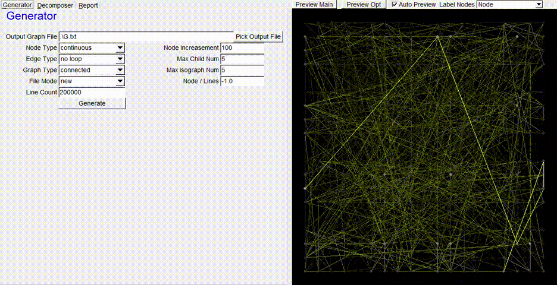

# 图生成与分解器
2020年秋季 问题求解与实践大作业


> Copyright (C) 2020 by LogCreative, All Rights Reserved. To learn more about the author, please visit https://github.com/LogCreative .
>
> (LC) No. 0211



## 存储库说明

### 使用
可以在 [发布栏](https://github.com/LogCreative/GraphGenDecomp/releases) 看到该软件的 Windows 发布版。（其余版本的编译正在尝试，欢迎PR）该软件可以随机生成子图，并根据比较有时间效率的启发式算法分割图形以限制每个子图的大小，有时间预期并可视化图。

> **2021/4 更新** feat: AlgComplexity HW08 可以通过子文件目录中的 ``partition.txt`` 获取划分信息，对主图进行手动划分，以便进行可视化。子图目录暂时不支持中文目录。

### 编译
需要在 Visual Studio 2019 的 include 文件夹加入 FL 的头文件以及 lib 文件夹加入已经编译好的 FLTK 库文件。或者仅查看命令行未使用 FLTK 库的部分。请将输出从 x64 调整为 x86，因为 FLTK 不支持 64 位平台的编译，需要预编译头 `WIN32`。

### 结构

```
GraphGenDecomp
	|-GraphDecomp 分解器主代码
		|-GraphDecomp.h 分解器头文件定义
		|-GraphDecomp.cpp 分解器代码
		|-DecompMain.cpp 分解器命令行
	|-GraphDecomposerUI 分解器UI
		|-Decomposer.cpp 分解器UI
	|-GraphGen 生成器代码
		|-GraphGen.h 生成器头文件定义
		|-GraphGen.cpp 生成器代码
		|-GenMain.cpp 生成器命令行
	|-GraphGenDecomp 主UI与图预览代码
		|-MainWindow.cpp 主UI
		|-GraphView.hpp 图预览代码
	|-GraphGeneratorUI 生成器UI
		|-Generator.cpp 生成器UI
	|-report 报告
		|-GraphGenDecomp.tex 报告代码
	|-GraphGenDecomp.sln VS工程文件
	|-GUI_facilities.h FLTK 库必要头文件
	|-std_lib_facilities.h 存放 STL 必要头文件
```

### 原理

更为详尽的说明，请见 [项目报告](https://github.com/LogCreative/GraphGenDecomp/blob/master/report/GraphGenDecomp.pdf)。

## 问题重述

1. 开发一个图自动生成器: 随机生成一个有向图，将图放置到指定文件中，每一行如下格式
    - <节点编号>：节点
	- <出发节点编号、结束节点编号、权重>：有向边
2. 开发一个图分解器
    - 分割图文件
     	- 将上述图分为若干子图，每个子图中节点数不大于 n。
     	- A图分割后，每个子图可以用单独的文件保存：如 A1,A2,A3,...
     	- 令子图之间的交互（即能够跨越子图边界的边）权重之和最小
     	- 我们将挑选若干自动生成的图，对比大家生成的权重之和值。在结果正确的前提下，计算权重之和越小，分数越高。
         	- 优化子图存储
     	- 上述图分割算法导致分割成的多个子图之间存在重复的节点，请设计一个方法，使
          	- 多个子图文件中分别载入程序后，不存在重复的节点
     	- 每个子图可以最多增加一个虚节点（如子图的文件名），代表外界（即其他子图）对该子图的引用
     	- 设计一个算法，将多个子图合并及删除虚节点后，检查与原图A一致。输出分割边的权重和。
    - 子图上算法
     	- 指定一个点，列出计算所有经有向边可达的节点
     	- 指定两个点，输出最短路径
     	- 如果指定的节点不存在，报错即可
